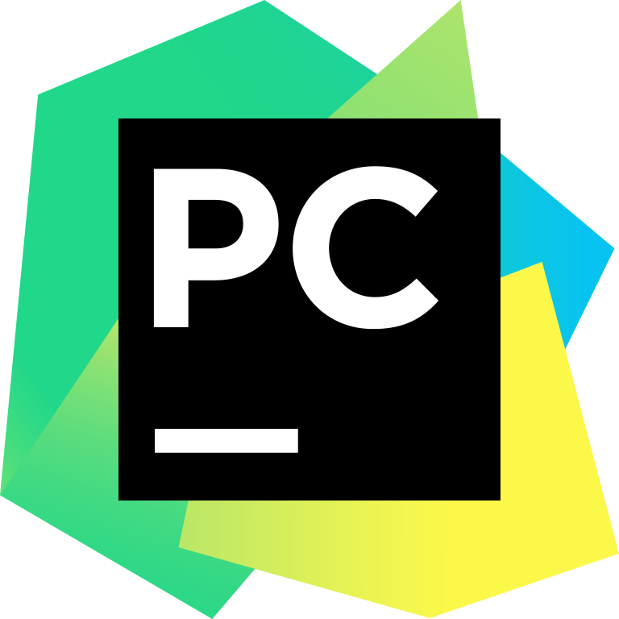

# 🦉 ileaf &nbsp; 

**`Sofware Engineeer | Backend Developer `**  

Add Introduction

 
---

### 🧰 Languages and Tools

 

#

### 📺 Project Demos

  

  

  

  

#

 <h3>👨‍💻 My Journey</h3>

Add text 

---
### Contact Information

 - ines.folha98@gmail.com
 - https://www.linkedin.com/in/inesfolha/
