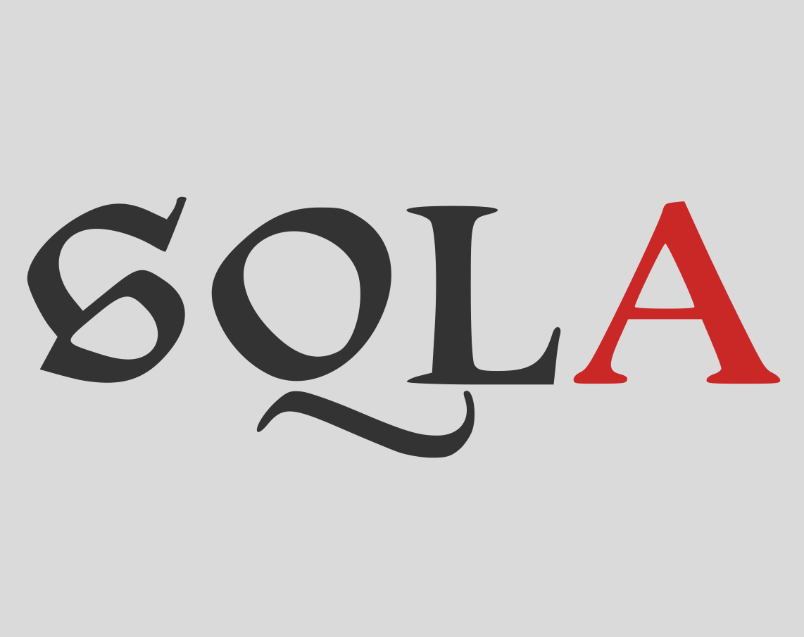

# 🏄‍♂️ ileaf

**`Sofware Engineeer | Backend Developer `**

I'm a 

---

### 🧰 Languages and Tools

 

---

### 📺 Project Demos

<!-- BEGIN YOUTUBE-CARDS -->

<!-- END YOUTUBE-CARDS -->

 
<h3>👨‍💻 ileaf's Coding Journey</h3>

[website]: https://
[Linkedin]: 